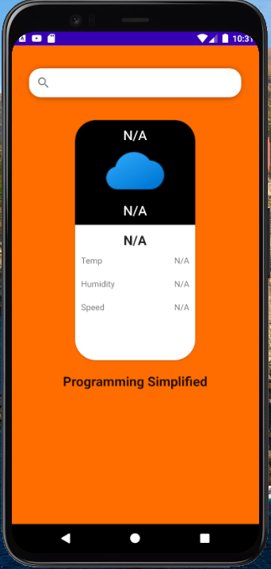
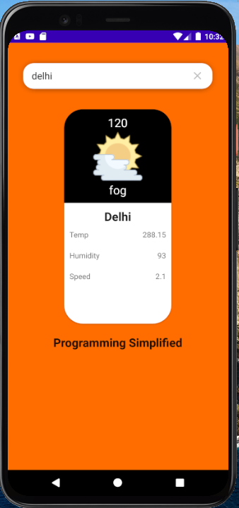

#Weather Application in Android Kotlin

In this project, we are going to make a weather application , with the help of dagger-hilt, retofit,coroutines,flow and channel. I have used openweather free api to make network request.

